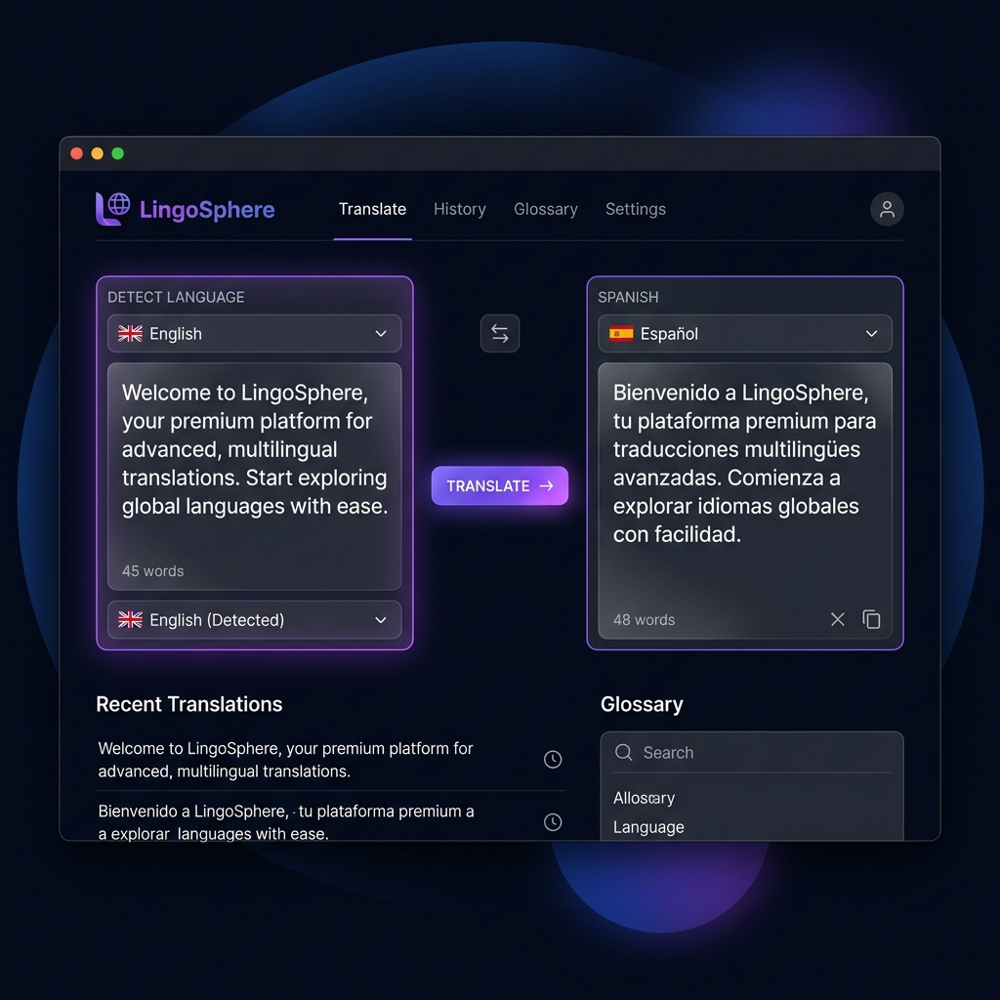

# 🌐 LingoSphere - Premium Translation Tool

LingoSphere is a premium, high-aesthetic neural translation frontend application designed to deliver seamless, real-time language translations across the globe. Built using high-performance, native browser technologies, LingoSphere pairs robust API capabilities with a stunning, futuristic user interface.

---

## 📸 Interface Preview



---

## ✨ Features

*   **Glassmorphic Dark Theme**: Features semi-transparent frosted cards (`backdrop-filter`), glowing borders, and modern sans-serif typography.
*   **Animated Ambient Atmosphere**: Drifting background glow orbs create an immersive, alive feel as you interact with the translator.
*   **Custom Searchable Language Selectors**: Ditch standard, hard-to-style select tags. LingoSphere comes with customized search panels that filter through **28 major international languages** in real-time.
*   **Smart Auto-Translation (Debounced)**: Keystrokes are tracked, and translations are automatically fetched **800ms** after you finish typing—saving unnecessary clicks.
*   **Interactive Manual Override**: A premium gradient action button with custom sliding arrow indicators forces an immediate manual translation request.
*   **Dynamic Visual State Indicators**: Active colors track state changes:
    *   ⚪ **Ready**: System is idle and ready for input.
    *   🟡 **Typing**: User is currently entering characters.
    *   🟣 **Translating**: Active API request (includes pulsing loaders).
    *   🟢 **Translated**: Translation successful.
    *   🔴 **Error**: Catch-all for networking or parsing faults.
*   **Flexible Swapping**: Quickly swap both language selections and input texts, and automatically re-translate with a click.

---

## 🛠️ Technology Stack

*   **Frontend**: HTML5, Vanilla CSS3 (Custom Grid layout, keyframes, transitions), ES6+ JavaScript.
*   **Neural API Integration**: Direct client-side fetch requests to the Google Translate REST API (free, zero token configuration required).
*   **Fonts**: Outfit (headings) & Inter (UI/body) connected via Google Fonts.
*   **Build Environment**: Vite (ultra-fast Hot Module Replacement dev server).

---

## 🚀 How to Run Locally

### Prerequisites
Make sure you have [Node.js](https://nodejs.org/) installed.

### Steps
1. **Clone the Repository**:
   ```bash
   git clone https://github.com/madhavcharan22/codealpha97941.git
   cd codealpha97941
   ```
2. **Install Dependencies**:
   ```bash
   npm install
   ```
3. **Start Development Server**:
   ```bash
   npm run dev
   ```
4. **Open in Browser**:
   Click the local address printed by Vite (typically `http://localhost:5173`).

---

## 📂 Project Structure

```
├── .gitignore               # Config to prevent committing node_modules or builds
├── package.json             # Dev scripts and Vite packages
├── index.html               # Semantic structures & layout wrappers
├── style.css                # Premium styling configurations
├── app.js                   # Client translation logic & dropdown handlers
└── lingosphere_screenshot.png # High-quality UI preview image
```

*Crafted with visual excellence.*
